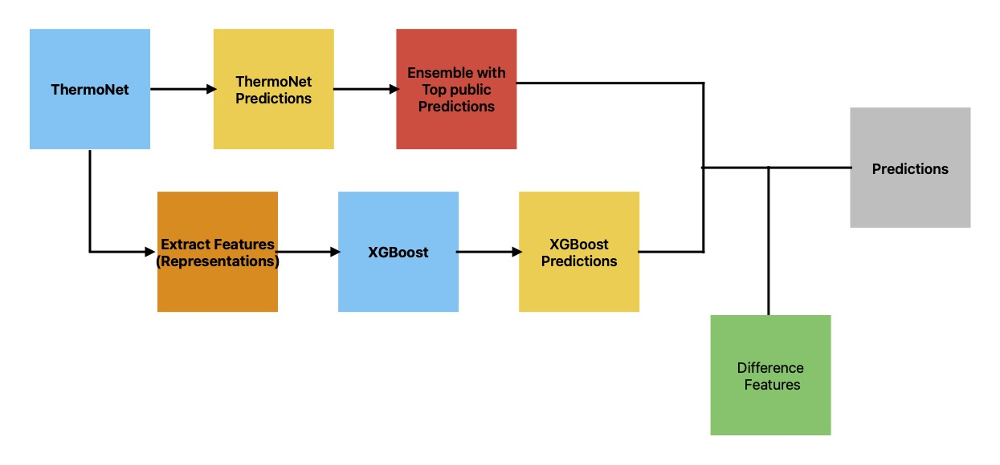

# Novozymes Enzyme Stability Prediction

The goal of the competition is to help identify the thermostable mutations in enzymes.

## [21st Place Solution](https://www.kaggle.com/competitions/novozymes-enzyme-stability-prediction/discussion/393308)

<h3>Representation Is All You Need</h3>
 

For more information about the competition, idea, experiments, and results. See the discussion [here](https://www.kaggle.com/competitions/novozymes-enzyme-stability-prediction/discussion/393308).

Codeflow: Soluation is 3 stages:
1. ThermoNet predictions.
2. Extract representaions and xgboost predictions.
3. Ensemble with different features.

Workspace: Kaggle notebook.

Dataset: from Kaggle competition.

 

Find more at [Kaggle@elcaiseri](https://kaggle.com/elcaiseri)